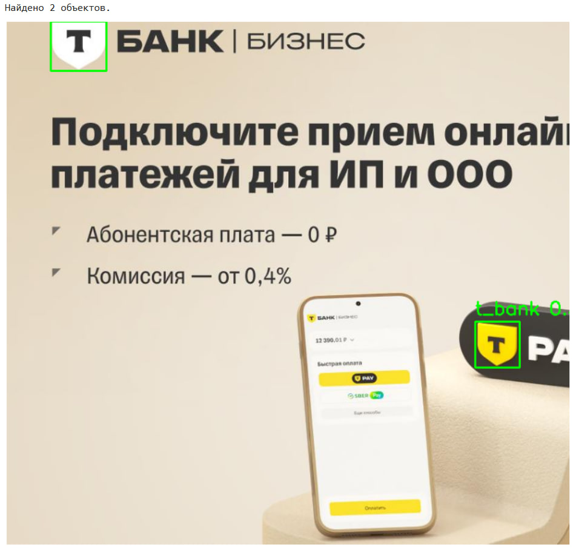

# Детектор логотипа Т-Банка на изображениях

Этот проект представляет собой end-to-end решение для задачи детекции объектов. Финальный продукт — это REST API сервис, упакованный в Docker-контейнер, который способен обнаруживать новый логотип Т-Банка на загружаемых изображениях и возвращать его координаты.

## 1. Постановка задачи

Основной целью проекта являлась разработка системы, способной в автоматическом режиме находить на изображениях логотип "Т-Банка". Логотип представляет собой стилизованную букву "Т" внутри геральдического щита.

**Ключевые требования и ограничения:**
- **Задача:** Детекция объектов (возврат координат bounding box).
- **Целевой объект:** Новый логотип "Т-Банка", игнорируя старый герб "Тинькофф".
- **Исходные данные:** Неразмеченный датасет из ~30,000 изображений.
- **Ограничения:**
    - Время обработки: не более 10 секунд на изображение.
    - Оборудование: возможность запуска на GPU с 16GB VRAM (уровня NVIDIA T4).
    - Формат решения: REST API в Docker-контейнере.

## 2. Zero-Shot разметка и выбор предобученной модели

Поскольку ручная разметка всех изображений — это трудоемкий и долгий процесс, было принято решение использовать **Zero-Shot подход** для получения первичной, "черновой" разметки.

В качестве базовой модели была выбрана **Grounding DINO** (`IDEA-Research/grounding-dino-base`). Эта модель способна детектировать объекты на изображении по их текстовому описанию, не требуя предварительного обучения на конкретных примерах целевого объекта. Это позволило быстро обработать весь неразмеченный датасет и получить первоначальный набор аннотаций.

Пример работы модели из официально документации: 
```
import os
import supervision as sv
IMAGE_NAME = "dog-3.jpeg"
IMAGE_PATH = os.path.join(HOME, "data", IMAGE_NAME)
TEXT_PROMPT = "chair with man sitting on it"
BOX_TRESHOLD = 0.35
TEXT_TRESHOLD = 0.25
image_source, image = load_image(IMAGE_PATH)
boxes, logits, phrases = predict(
 model=model,
 image=image,
 caption=TEXT_PROMPT,
 box_threshold=BOX_TRESHOLD,
 text_threshold=TEXT_TRESHOLD
)
annotated_frame = annotate(image_source=image_source, boxes=boxes,
logits=logits, phrases=phrases)
%matplotlib inline
sv.plot_image(annotated_frame, (16, 16))
```


## 3. Кластеризация и анализ результатов

После получения автоматических детекций был проведен их анализ для оценки качества работы Zero-Shot подхода. Все найденные объекты (вырезанные из изображений по предсказанным координатам) были кластеризованы.

**Процесс кластеризации:**
1.  **Извлечение признаков:** Каждый вырезанный объект был пропущен через предобученную нейросеть (ResNet50) для получения векторного представления (эмбеддинга).
2.  **Кластеризация:** Полученные векторы были сгруппированы с помощью алгоритма KMeans.

**Результаты анализа:**
Кластеризация показала, что модель Grounding DINO успешно находила объекты, похожие на "щит с буквой",
однако первоначальный общий промпт приводил к большому количеству ложных срабатываний (другие эмблемы). Особенно были частые срабатывания на схожей цветовой палитре.


Пример ложного срабатывания:


## 4. Итеративный подбор текстового промпта

Стало очевидно, что качество Zero-Shot разметки напрямую зависит от точности текстового промпта. Было проведено несколько итераций тестирования различный промптов на небольшой выборке для нахождения оптимального варианта.

Сравнивались как общие описания, так и детализированные, с указанием цветов и визуальных атрибутов. Лучший результат показал промпт, сфокусированный на визуальном стиле и контрасте, который хорошо обобщал различные вариации логотипа:
```
"a high-contrast, minimalist shield emblem containing a single capital letter T"
```
Этот промпт позволил значительно повысить точность первичной разметки и стал основой для дальнейшей работы.

Примеры промтов, наш финалист под номером 2. Эмпирическим методом, он показал лучшую точность обнаружения.


## 5. Подготовка данных для ручной доразметки

Автоматически полученные аннотации были конвертированы из формата JSON в формат **XML Pascal VOC** для использования в CVAT.

## 6. Работа в CVAT

В качестве инструмента для ручной доразметки был выбран **CVAT (Computer Vision Annotation Tool)**. В него были загружены ~15000 изображений, на которых сработала Zero-Shot модель, вместе с соответствующей XML-разметкой.

Процесс доразметки включал в себя:
- **Коррекцию** неточных рамок.
- **Удаление** ложных срабатываний.
- **Добавление** пропущенных моделью логотипов.

Этот подход "Human-in-the-Loop" позволил в кратчайшие сроки получить высококачественный размеченный датасет.

## 7. Обучение финальной модели (YOLOv8s)

После доразметки был сформирован финальный датасет, 
Изначально я пробовал использование модели YOLOv8n и YOLOv8m, но первая была отброшена из-за низкого качества, вторая из-за слишком длительного времени обучения, даже на низком разрешении
В итоге для дообучения была выбрана модель **YOLOv8s ("small")** как оптимальный баланс между скоростью и точностью, полностью удовлетворяющий требованиям задачи. Обучение проводилось в среде Kaggle Notebooks с использованием двух GPU T4.
Обучение заняло 3,5 часа 
гиперпараметры следующие:epochs=60, imgsz=640, batch=64, patience=15
Model summary (fused): 72 layers, 11,125,971 parameters, 0 gradients, 28.4 GFLOPs

Финальная модель показала высокие метрики на валидационной выборке:
- **Precision:** ~0.94
- **Recall:** ~0.80
- **mAP50:** ~0.84


Если рассматривать примеры, то ложные срабатывания почти не происходят. Также модель находит не самые очевидные объекты, как ниже: 


Но может ошибаться с очень мелкими логотипами, скорее всего, из-за нехватки разрешения:


## 8. Создание REST API

Обученная модель (`best.pt`) была интегрирована в веб-сервис с использованием **FastAPI**. 
Сервис предоставляет один эндпоинт `/detect`, который принимает изображение и возвращает JSON-ответ со списком координат найденных логотипов, соответствуя заданному контракту API.

### Скачивание дополнительных данных

*   Валидационный набор данных: https://drive.google.com/file/d/1iF4lJmug4Aejtv3BsVn-qYQUPiJoDHE4/view?usp=sharing


### Установка и запуск

**Пререквизиты:**
- Docker

### Быстрый запуск 

Образ уже собран и опубликован, вы можете ознакомится с решением следующим скриптом:

*   **Для запуска только на CPU**
    ```bash
    docker run -p 8000:8000 -d serghei111/t_bank_final:latest
    ```

После запуска сервис будет доступен по адресу `http://localhost:8000`. Для проверки работоспособности и просмотра интерактивной документации откройте в браузере `http://localhost:8000/docs`.

### Сборка из исходного кода 

Если вы хотите внести изменения в код, следуйте этой инструкции:
1.  **Клонируйте репозиторий:**
    ```bash
    git clone https://github.com/Serghei-S/t_bank_final
    cd t_bank_final
    ```
2. **Соберите Docker-образ:**
    ```bash
    docker build -t tbank-detector .
    ```
3. **Запустите собранный контейнер** (см. команды в разделе "Быстрый запуск").

# Валидация решения

*Для валидации решения необходимо*:
1. Скачайте  данные по ссылке выше и поместите их в папку `validation_data`.
2. Установите Python-зависимости для скрипта локально: `pip install requests tqdm Pillow`.
3. Запустите скрипт:
    ```bash
    python validate.py
    ```
Скрипт выведет метрики Precision, Recall, F1-Score и среднее время обработки.
## 9.Возможности по улучшению

- разнообразие выборки, в ней присутствовало большое количество схожих логотипов на желтом фоне в левом углу экрана.
Пример: 


    И довольно малеьнкое количество более "необычных" логотипов на зданиях, либо других объектах.

- Использование большего разрешения и модели YOLOv8m или YOLOv8l
- Добавление более "агрессивных" аугментаций: изменение яркости/контраста, размытие, добавление шума. Это сделает модель более робастной.
- Эксперименты с использованием модели для разметки другую модель, YOLO-World или Grounded-SAM
- Использование всех 30000 тысяч фотографий, а не 15 тысяч.